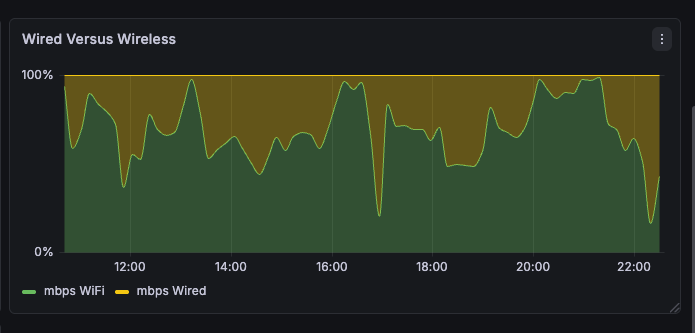
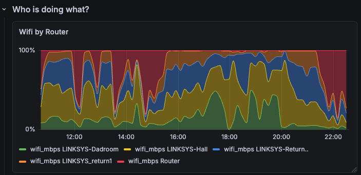
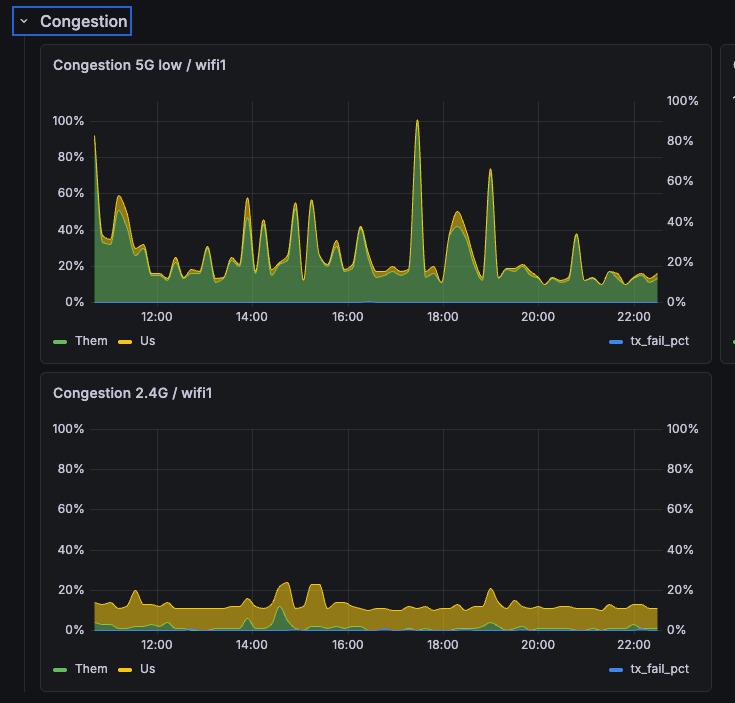

# linksys-velop-watcher

A watcher that periodically downloads the `sysinfo.cgi` diagnostic dump from a
Linksys Velop mesh router and produces each snapshot to Kafka as
Confluent-Avro, to study the router and track how its state changes over time.
[Kafka Connect JDBC sinks](connect/) land the records in
[CrateDB](https://crate.io/).

Each run parses the dump into structured, snapshot-linked records (devices, wlan
clients, backhaul, nodes, ping, radio stats/config, nic counters, system, ip
neighbors, lldp) — one Kafka topic (`velop.<table>`) per table. Every MAC
address is annotated with its vendor via an **offline** OUI lookup — MAC
addresses never leave the network.

## What is `sysinfo.cgi`?

`sysinfo.cgi` is an **undocumented diagnostic endpoint** built into Linksys Velop
firmware. Every node serves it at `https://<node-ip>/sysinfo.cgi` (HTTP Basic
auth, user `admin`, your Velop admin password). Requesting it makes the node run
a batch of on-device diagnostics and **stream back one large plain-text report**
(~4,800 lines / ~240 KB on the author's mesh): wireless config and scans,
per-radio counters, the backhaul (`bh_report`) table, the device/client lists,
ARP/LLDP neighbours, NIC counters, ping checks, and a slice of the system log.
It's the same data Linksys support has customers pull when diagnosing a mesh.

It is **per-node** — the master reports only its own radios/system, so this
watcher also fetches each satellite's `sysinfo.cgi` (see [How it works](#how-it-works)).
There is no official schema; the page format is reverse-engineered, and
[`sampleoutput.txt`](sampleoutput.txt) is a full (sanitised) real dump kept as the
parser reference. The page streams slowly and ends with a
`**** End of Sysinfo Output ****` marker, so the fetcher reads to that marker
rather than trusting connection close.

**More info**

- Linksys community — [Sysinfo.cgi login info](https://community.linksys.com/t5/Velop-Whole-Home-Wi-Fi/Sysinfo-cgi-login-info/td-p/1399934) (finding a node's IP and logging in)
- Linksys community — [How accurate is sysinfo.cgi](https://community.linksys.com/t5/Velop-Whole-Home-Wi-Fi/How-accurate-is-sysinfo-cgi/td-p/1412271)
- SNBForums — [using `bh_report` to tune node placement](https://www.snbforums.com/threads/suggestions-on-how-to-better-setup-this-network.65534/)
- GitHub gist — [following the Velop log printed by `sysinfo.cgi`](https://gist.github.com/core2duoe6420/3361c0ed7d9a654bd056f3c953d10767)

**Models known to expose `sysinfo.cgi`**

| Model | Velop name | Role tested here | Status |
|---|---|---|---|
| **MX42** / MX4200 | Velop AX4200 (Wi‑Fi 6, tri‑band) | master | ✅ Confirmed — the author's master node |
| **WHW03** (V1/V2) | Velop AC2200 (Wi‑Fi 5, tri‑band) | satellite | ✅ Confirmed — the author's satellite nodes |

The endpoint appears across the Velop line running this firmware family — other
`MX*` (e.g. MX5300 / Velop AX5300) and `WHW*` nodes are community-reported to
expose it as well, but only the two models above are verified by this project.
If you run the watcher against another model, a PR updating this table is welcome.

## How it works

```
cli.main() → fetch_sysinfo(cfg) → parse.* → enrich(...) → KafkaSink (Avro)
                                                              ↓
                              Kafka topics → Connect JDBC sinks → CrateDB
```

- **fetch** — the CGI streams its output slowly, so the fetcher reads the
  response as a stream and stops only when the `End of Sysinfo Output`
  completion marker appears, never on connection close alone.
- **parse** — pure, defensive parsers turn the raw text into `list[dict]`
  records. No network or DB; unit-tested against `sampleoutput.txt`.
- **name enrich** — the CGI `Name` column is truncated to ~16 chars and often
  blank, so each device is also looked up via the Velop's **JNAP**
  `GetDevices3` API (`/JNAP/`) and its untruncated `friendlyName` stored in
  `friendly_name`. Best-effort: a JNAP failure just leaves the column NULL.
- **vendor enrich** — each MAC's 24-bit OUI is resolved against a local
  Wireshark `manuf` file (offline, no cache DB needed).
- **produce** — each structured record is produced to its `velop.<table>` topic
  as Confluent-Avro; the schemas auto-register in the Schema Registry. A
  per-record `id` is the CrateDB primary key, so a Connect sink upsert never
  duplicates a row on re-delivery. See [`connect/`](connect/) for the sinks and
  `sql/velop_schema.sql` for the CrateDB DDL.

## Prerequisites

This watcher is the **producer** at the head of a pipeline; it assumes the rest
of that pipeline already exists. None of the infrastructure below is stood up for
you.

**To run the watcher itself:**

- A **Linksys Velop** mesh that exposes [`sysinfo.cgi`](#what-is-sysinfocgi),
  reachable over HTTPS, plus its admin password.
- **Python 3.10+** (installed as an editable package — see [Setup](#setup)).
- A **Kafka broker** *and* a **Confluent Schema Registry** the watcher can reach
  (`KAFKA_BOOTSTRAP`, `SCHEMA_REGISTRY_URL`). Kafka is the **only** sink: the
  watcher produces Confluent-Avro and registers one schema per `velop.<table>`
  topic, so a registry is required, not optional. Any Kafka with a Schema
  Registry works (Confluent Platform, Redpanda, etc.).

**To land the data in a database (the downstream pipeline):**

- **Kafka Connect** running the **Confluent JDBC Sink** connector. The connector
  configs in [`connect/`](connect/) (one per topic) consume each topic and
  `upsert` into the database over pg-wire; register them with the helper scripts
  there.
- **CrateDB** as the destination. The `velop.*` tables must **pre-exist** — apply
  [`sql/velop_schema.sql`](sql/velop_schema.sql) once (the sinks run
  `auto.create=false`). Another pg-wire target the JDBC sink supports could be
  substituted, but the schema and views here are written for CrateDB.

**For dashboards (optional):**

- **Grafana** with its **PostgreSQL** datasource pointed at CrateDB's pg-wire
  port. Example panels/views live in [`sql/`](sql/) (`grafana_*.sql`). Mind the
  CrateDB↔Grafana `NUMERIC` gotcha documented in
  [`sql/grafana_radio_rates.sql`](sql/grafana_radio_rates.sql) — cast computed
  numeric columns to `DOUBLE`/`REAL` or Grafana silently drops them.

> **Minimum to see anything:** Velop + Kafka + Schema Registry — the watcher runs
> and produces. Add Connect + CrateDB for persistence, then Grafana for
> visualisation. These can be co-located or spread across hosts (the author runs
> Kafka/registry/Connect on one box and CrateDB on another).

## Setup

```bash
python3 -m venv .venv
source .venv/bin/activate
pip install -e ".[dev]"
cp .env.example .env          # then edit .env (see below)
```

### Configuration

All runtime settings come from environment variables (see `.env.example`).
`.env` is gitignored — keep secrets there, not in source.

> **The defaults below are the author's home setup** — the router at
> `10.13.1.1` and Kafka/registry/CrateDB on hosts named `badger`/`endowment`.
> Change them to match your own network. Likewise, the `connect/*.json` sink
> configs ship `CHANGEME_CRATE_USER`/`CHANGEME_CRATE_PASSWORD` placeholders you
> must set (see [`connect/`](connect/)). The router password is **never** stored
> in the repo — it is read from `VELOP_PASSWORD` at runtime only.

| Variable          | Purpose                                  | Default                          |
| ----------------- | ---------------------------------------- | -------------------------------- |
| `VELOP_URL`       | Router sysinfo endpoint                  | `https://10.13.1.1/sysinfo.cgi`  |
| `VELOP_USER`      | Router HTTP Basic user                   | `admin`                          |
| `VELOP_PASSWORD`  | Router password (**required**)           | —                                |
| `VELOP_VERIFY_TLS`| Verify the router's TLS cert             | `false` (self-signed cert)       |
| `VELOP_JNAP_URL`  | JNAP device-name endpoint (optional)     | derived from `VELOP_URL` (`/JNAP/`) |
| `KAFKA_BOOTSTRAP` | Kafka broker(s)                          | `badger:9092`                    |
| `SCHEMA_REGISTRY_URL` | Confluent Schema Registry            | `http://badger:8081`             |
| `OUI_MANUF_PATH`  | Local Wireshark `manuf` file path        | `manuf`                          |
| `OUI_MANUF_URL`   | Where `velop-oui-update` downloads it    | Wireshark automated data URL     |

> The watcher only produces to Kafka. The [`connect/`](connect/) Kafka Connect
> JDBC sinks land the records in CrateDB over pg-wire; the `velop.*` tables must
> exist first (`crash < sql/velop_schema.sql`).

## Running

```bash
set -a; source .env; set +a   # load .env into the environment
velop-oui-update              # one-time: fetch the Wireshark manuf vendor file
velop-watcher                 # fetch one snapshot and produce it to Kafka
```

Create the CrateDB tables once (`crash < sql/velop_schema.sql`) and install the
Connect sinks (see [`connect/`](connect/)) so the produced records land in
CrateDB. A missing `manuf` file is not fatal — the vendor columns just stay NULL
until you run `velop-oui-update`.

### Convenience wrapper

`run-watcher.sh` exports all non-secret config and takes the **router password
as its first argument** (or the `VELOP_PASSWORD` env var):

```bash
./run-watcher.sh 'your-router-password'
```

To run it as a service on a Raspberry Pi, see [`systemd/`](systemd/).

## Dashboards

Once the records are landing in CrateDB, the views in [`sql/`](sql/)
(`grafana_*.sql`) drive Grafana panels. Import
[`grafana/velop.json`](grafana/velop.json) to get the author's dashboard (point
its PostgreSQL datasource at your CrateDB). Some example panels:

**Wired vs. wireless throughput** — total mesh WiFi against wired traffic
([`sql/grafana_wifi_vs_wired.sql`](sql/grafana_wifi_vs_wired.sql)).



**WiFi by node** — how much WiFi each node is serving
([`sql/grafana_node_wifi.sql`](sql/grafana_node_wifi.sql)).



**Channel congestion** — airtime use (us vs. others) and TX-failure rate per
band, from the per-radio counters
([`sql/grafana_radio_rates.sql`](sql/grafana_radio_rates.sql)).



> Heads-up: Grafana's PostgreSQL datasource silently drops `NUMERIC` columns —
> cast computed numerics to `DOUBLE`/`REAL`. See
> [`sql/grafana_radio_rates.sql`](sql/grafana_radio_rates.sql) for the details.

## Tests

```bash
pytest                       # all tests
pytest tests/test_fetch.py   # one file
```

The unit tests cover only pure logic (config, timestamp/marker parsing, the
parsers against `sampleoutput.txt`, and the Avro spec/schema helpers). The
network and Kafka paths require a live router and broker and are not exercised
by the tests.
